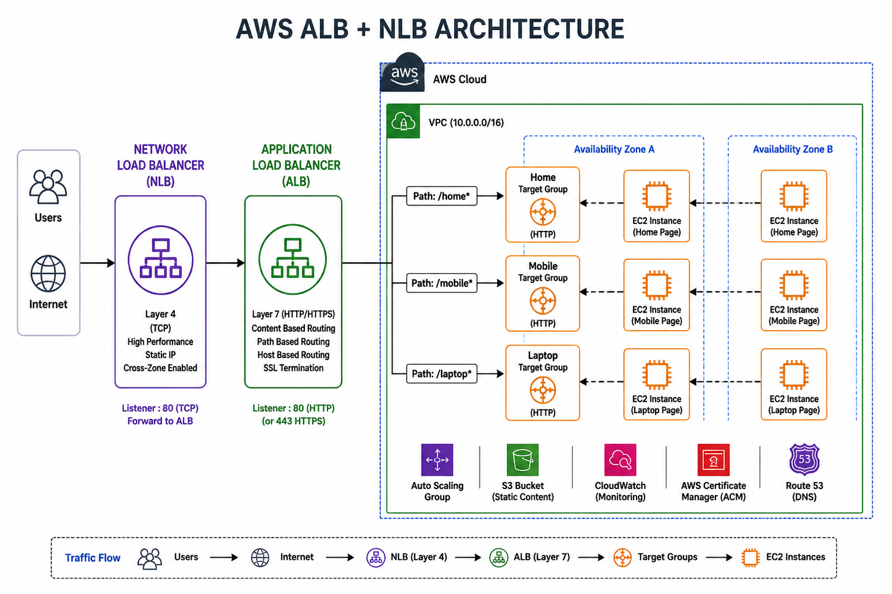
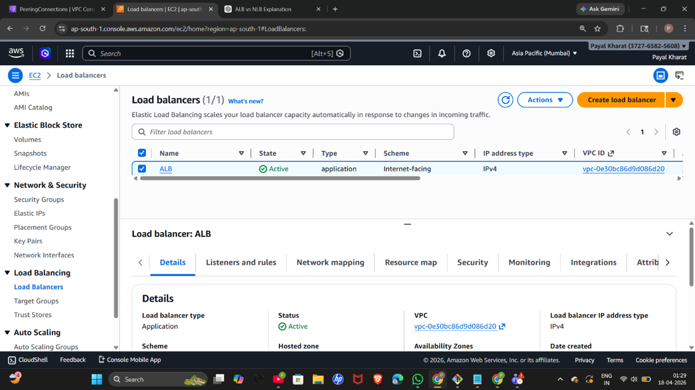
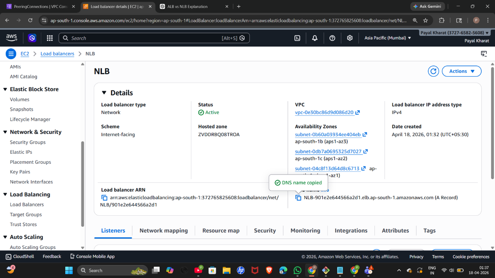

# AWS ALB + NLB Architecture Project

## 📌 Overview
This project demonstrates a real-world AWS architecture combining Network Load Balancer (NLB) and Application Load Balancer (ALB).

- NLB handles high-performance traffic at Layer 4
- ALB handles intelligent routing at Layer 7
- Used for scalable and highly available web applications

---

## 🏗️ Architecture

### Flow:
Client → NLB → ALB → Target Groups → EC2 Instances

---

## ⚙️ Services Used

- AWS EC2
- Application Load Balancer (ALB)
- Network Load Balancer (NLB)
- Target Groups
- Auto Scaling (optional)

---

## 🔧 Implementation Steps

### Step 1: Create EC2 Instances
- Launch multiple EC2 instances
- Install web server (Apache/Nginx)
- Create different pages (Home, Mobile, Laptop)

---

### Step 2: Create Target Groups
- Create separate target groups:
  - Home TG
  - Mobile TG
  - Laptop TG
- Register EC2 instances

---

### Step 3: Create ALB
- Configure ALB (Layer 7)
- Add listeners:
  - `/home`
  - `/mobile`
  - `/laptop`
- Attach target groups

---

### Step 4: Create NLB
- Configure NLB (Layer 4)
- Forward traffic to ALB

---

### Step 5: Testing
- Access via NLB DNS
- Verify routing works correctly

---

## 📸 Screenshots

### ALB

### NLB

---

## 🎯 Key Learnings

- Difference between ALB and NLB
- Layer 4 vs Layer 7 routing
- High availability architecture
- Load balancing strategies

---

## 📌 Use Cases

- High traffic applications
- Microservices architecture
- Real-time applications

---

## 👨‍💻 Author
Payal Kharat
